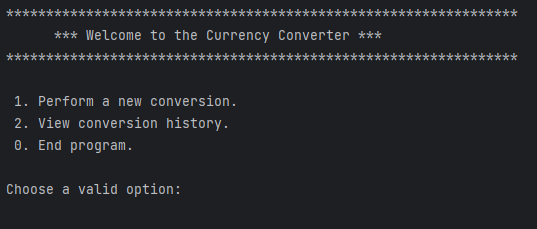
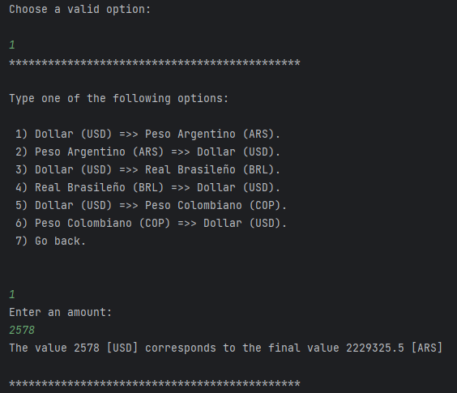
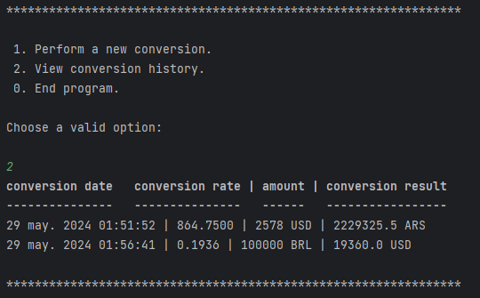
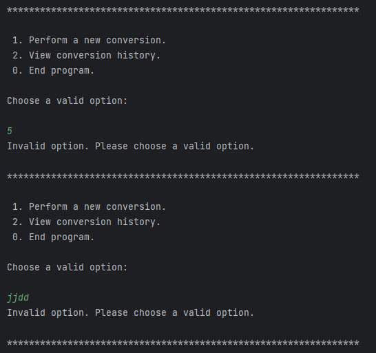

# 💱 Currency Converter 

> This is one of the challenges proposed by Alura Latam in the Oracle Next Education program.

This project is a currency converter program. It allows users to convert amounts between different currencies using the
current exchange rates it obtains from requests to the https://www.exchangerate-api.com/ API.

## 🚀 Demo

The program displays a main menu where the user can select between the options of performing a conversion, viewing the
conversion history, or exiting the execution.

### Main Menu



### Example of Currency Conversion



### Example of Conversion History



### Example of validations



## ⚙️ Project Structure

1. `Main`: This class contains the interactive menu and serves as a connection to the other classes.
2. `ApiConnect`: This class is responsible for making the HTTP request to the ExchangeRate API and obtaining the
   exchange rates.
3. `Currency`: This class represents a currency conversion, with properties such as source currency, destination
   currency, exchange rate, converted amount, and timestamp.
4. `CurrencyDTO`: This class allows to transfer the data from the API response to the Currency class.
5. `CurrencyConverter`: This class contains the logic to perform currency conversions.
6. `Literals`: This class is a utility class that contains the menu and textual interface options.

## 🔧 Installation

Before all, make sure you have Java (JAVA SDK 17) and some IDE (for example IntelliJ IDEA or Eclipse) installed.

### 1. Initialize the project

- Clone the repository
  ``` bash
  git clone https://github.com/kmartiat/ConversorApp.git
  ```

### 2. Run the application.

This can be done with the IDE of choice (IntelliJ IDEA or another).

## 🛠️ Built With

### Tech Stack

<ul>
    <li><a href="https://www.oracle.com/pe/java/" target="_blank">Java 17</a></li>
    <li><a href="https://mvnrepository.com/artifact/com.google.code.gson/gson" target="_blank">Gson library</a></li>
</ul>

## 📝 License

The MIT License (MIT)